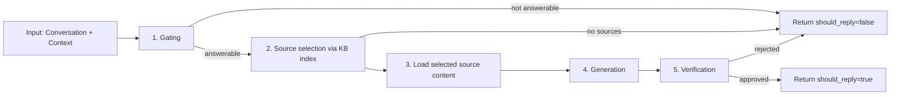

# Module Design: AI Response

## Purpose

The AI Response module receives a platform-neutral `Conversation` and `RequestContext`, decides whether to respond, sends the Knowledge Base index to the LLM to choose relevant sources, loads the chosen source content, uses that knowledge as context to generate an answer with citations, and runs a lightweight verification step to ensure the result is safe and clear to post publicly.

This module is **stateless**: it does not store chat history. All conversational context is provided per request by the adapter.

## Responsibilities

- Accept `Conversation` and `RequestContext` from adapters.
- Use an LLM call with a gating prompt to decide whether the question is answerable.
- If the question is answerable, ask the LLM to select which sources to load using the Knowledge Base index text.
- If no suitable sources are found, return `should_reply=false`.
- Load full content for the selected identifiers from the Knowledge Base.
- Use the selected source content as context for the LLM to generate an answer with citations.
- Verify answer quality with a separate LLM verification call and return `should_reply=true` only when verification approves the draft.
- Return a strict `AIResult` schema for adapters.

## External dependencies

- `langgraph` target 1.0.5 for orchestration
- LLM provider clients kept behind `LLMClient`
- Knowledge Base module interface

## Public interface

See `src/discord_intern/ai/interfaces.py` `AIClient`.

The adapter treats the AI module as a single async call:

- If `AIResult.should_reply` is `false`, the adapter does nothing.
- If `true`, the adapter posts `reply_text` in a thread.

## Auxiliary interface: text summarization

The Knowledge Base module needs to create a small startup index. Index generation MUST use an LLM to produce short human-readable descriptions for source selection.

To avoid coupling index generation to the full `generate_reply` workflow, the AI module MUST expose a dedicated text summarization method.

See `src/discord_intern/ai/interfaces.py` `AIClient.summarize_for_kb_index`.

### Contract

Method:

- `summarize_for_kb_index` takes `source_id`, `text`, and `timeout_seconds` and returns `str`

Requirements:

- Output MUST be plain English text suitable for inclusion in the KB index artifact.
- Output MUST be short and focused on what the source covers and when it is relevant.
- On failure, the summarization call MUST raise an error to the caller.

## Shared data models

These are the same models used by the adapter design doc.

See `src/discord_intern/core/models.py`.

## Configuration

The AI module is configured under the `ai` section in `config.yaml`.

### Keys

- `ai.request_timeout_seconds`: End-to-end timeout for `generate_reply`.
- `ai.llm_timeout_seconds`: Per LLM call timeout.
- `ai.max_retries`: Maximum retry attempts for transient provider failures.

- `ai.gating_prompt`: Prompt for the question gating decision.
- `ai.selection_prompt`: Prompt for source selection using the KB index text.
- `ai.summarization_prompt`: Prompt for Knowledge Base index summarization.
- `ai.answer_prompt`: Prompt for answer generation.
- `ai.verification_prompt`: Prompt for answer verification.

- `ai.max_sources`: Maximum number of selected sources to load per request.

- `ai.max_answer_chars`: Maximum characters in the returned answer.
- `ai.require_citations`: If true, return `should_reply=false` when no citations can be produced.

## Orchestration

### Requirements

#### Orchestration

- The workflow MUST be modeled as a small LangGraph state graph with explicit nodes for gating, source selection, content loading, answer generation, and verification.
- The graph MUST have clear edges and conditional flow so the control flow is auditable and testable.

#### State

- Graph state MUST be defined as a `TypedDict`.
- State MUST remain minimal and typed. Nodes MUST pass only what the next node needs and avoid storing large raw source text in state.

#### Structured decisions

- Nodes that decide gating, source selection, or verification MUST return strict, typed data.
- Decision schemas MUST be stable for logging and tests.

#### No persistent memory

- The graph MUST be compiled with checkpointing explicitly disabled.
- Durable execution, checkpointers, or any other persistent memory MUST NOT be used.

#### Async execution

- Node functions MUST be async.
- Provider calls MUST use async clients for network I/O.
- Provider calls MUST use bounded retries and clear timeout policies.

### High-level node graph

Nodes:

1. Question gating
2. Source selection using KB index text
3. Load selected source content from Knowledge Base
4. Answer generation
5. Answer verification

### Typed graph state

Keep state minimal and typed. Do not store full documents; store only what the next node needs.

See `src/discord_intern/ai/types.py`.

### Statelessness enforcement

- The AI module MUST NOT use durable LangGraph checkpointers.
- The graph MUST be compiled with checkpointing disabled.
- The AI module MUST NOT persist conversation history.

## Node designs

### Node 1: Question gating

**Goal**: decide whether the input is answerable.

Inputs:
- `conversation` use most recent user message as the primary question
- `config.gating_prompt`

Output:
- `is_question: bool`
- `is_answerable: bool`
- `rewrite_query: str | None`
- `reason: str` for logging and debugging only

Behavior:
- If not answerable, end early with `should_reply=false`.

### Node 2: Source selection via Knowledge Base index text

**Goal**: select which file paths and URLs to load as context.

Inputs:
- `query`
- `kb_index_text`
- `config.selection_prompt`

Output:
- `selected_source_ids`

Behavior:
- Send `kb_index_text` and the query to the LLM.
- The LLM returns a list of identifiers from the index.
- Truncate deterministically to `ai.max_sources`.
- If `selected_source_ids` is empty, return `should_reply=false`.

### Node 3: Load selected source content

**Goal**: load full content for the selected identifiers.

Inputs:

- `selected_source_ids`
- `config` content loading policy

Output:

- `selected_sources` as a list of `{source_id, text}`

Behavior:

- For each selected identifier, call the Knowledge Base loader and collect the returned text.
- If a selected identifier fails to load, log it and continue, unless no content can be loaded at all.

### Node 4: Answer generation

**Goal**: produce an answer with citations.

This step uses the LLM to generate the answer.

Inputs:
- `conversation`
- `user_question`
- `selected_sources` with source IDs
- `config.answer_prompt`

Output:
- `draft_answer`
- `citations`

Constraints:
- The answer MUST be concise.
- The answer MUST NOT exceed `ai.max_answer_chars`.
- Do not fabricate sources; citations MUST reference selected `source_id`s.
- If `require_citations=true` and selected source content is empty, return `should_reply=false`.

### Node 5: Answer verification

**Goal**: decide if the draft is safe and clear to post publicly.

Inputs:
- `draft_answer`
- `selected_sources` as context
- `config.verification_prompt`

Output:
- `is_good_enough: bool`
- `issues: list[str]`
- `suggested_fix: str | None`

Behavior:
- If `is_good_enough=true`, return `should_reply=true` with `reply_text=draft_answer`.
- Otherwise return `should_reply=false`.

## LLM boundary

Keep provider-specific logic behind a protocol so swapping providers does not change the graph logic.

See `src/discord_intern/ai/interfaces.py` `LLMClient`.

## Error handling and timeouts

- Apply a strict end-to-end request timeout `config.request_timeout_seconds` around `generate_reply`.
- Each LLM call MUST have its own timeout `config.llm_timeout_seconds`.
- Use bounded retries with jitter for transient provider failures; do not retry on:
  - invalid request errors
  - prompt/schema validation errors
- On any failure that prevents a verified answer, return `should_reply=false`.

## Observability

Log fields:

- `platform`, `channel_id`, `thread_id`, `message_id`
- `gate.is_question`, `gate.is_answerable`, `gate.reason`
- `selection.selected_sources_count`, `loading.loaded_sources_count`
- `verification.is_good_enough`, `verification.issues_count`
- Latencies per node and per provider call

Metrics:

- `ai_requests_total{result=answered|skipped|error}`
- `ai_gate_total{answerable=true|false}`
- `ai_verification_total{good_enough=true|false}`
- `ai_selected_sources_histogram`

## Test plan

- Unit tests:
  - Gating decision parsing and early-exit behavior
  - Source selection parsing and source selection bounding
  - Citation integrity, citations only from loaded sources
  - Verification parsing and skip behavior
- Contract tests:
  - `generate_reply` returns a valid `AIResult` for representative inputs
  - Timeouts cause `should_reply=false` and do not raise to adapter

## Config-driven prompting

Prompts and policies for question gating MUST be stored in configuration so communities can tune what the bot answers without code changes.

Configuration MUST include:

- Answer scope prompt: what topics/questions to answer.
- Refusal policy: what to ignore vs. provide a safe redirect.

Answer verification is intentionally not configurable; it is a separate LLM evaluation call.

## AIResult shape

The AI module MUST return a single normalized result:

- `should_reply: bool`
- `reply_text: str | None`
- `citations: list[Citation]`
- `debug: dict | None` never post to users
