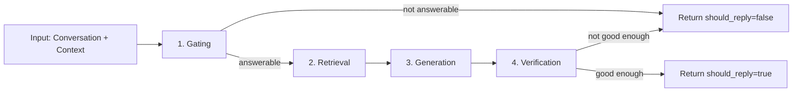

# Module Design: AI Response (Stateless Orchestration + Answer Generation)

## Purpose

The AI Response module receives a platform-neutral `Conversation` and `RequestContext`, decides whether to respond, retrieves minimal relevant knowledge using the Knowledge Base module, generates a grounded answer with citations, and runs a lightweight verification step to ensure the result is safe and clear to post publicly.

This module is **stateless**: it does not store chat history. All conversational context is provided per request by the adapter.

## Responsibilities

- Accept `Conversation` + `RequestContext` from adapters (Discord now, other platforms later).
- Decide whether a reply is needed (config-driven gating).
- Retrieve minimal relevant context (index-first via Knowledge Base).
- Generate an answer grounded in retrieved snippets + conversation context.
- Verify answer quality with a second LLM check; return answers only when “good enough”.
- Return a strict `AIResult` schema for adapters.

## External dependencies

- `langgraph` (target: 1.0.5) for orchestration
- LLM provider client(s) (implementation choice; kept behind `LLMClient` protocol)
- Knowledge Base module interface (index + retrieval)

## Public interface (adapter boundary)

See:

- `src/discord_intern/ai/interfaces.py` (`AIClient`)

The adapter treats the AI module as a single async call:

- If `AIResult.should_reply` is `false`, the adapter does nothing.
- If `true`, the adapter posts `reply_text` in a thread.

## Shared data models (boundary)

These are the same models used by the adapter design doc.

See the shared boundary models in:

- `src/discord_intern/core/models.py`

## Configuration

The AI module is configured under the `ai` section in `config.yaml`.

### Keys

- `ai.request_timeout_seconds` (float): End-to-end timeout for `generate_reply(...)`.
- `ai.llm_timeout_seconds` (float): Per-LLM-call timeout.
- `ai.max_retries` (int): Maximum retry attempts for transient LLM/provider failures.

- `ai.gating_prompt` (string): Prompt for the question gating decision.
- `ai.answer_prompt` (string): Prompt for answer generation.
- `ai.verification_prompt` (string): Prompt for answer verification.

- `ai.max_sources` (int): Maximum number of sources to use for a single request.
- `ai.max_snippets` (int): Maximum number of snippets to pass into generation.
- `ai.max_snippet_chars` (int): Maximum characters per snippet.
- `ai.min_snippet_score` (float): Minimum relevance score for a snippet to be included.

- `ai.max_answer_chars` (int): Maximum characters in the returned answer.
- `ai.require_citations` (bool): If true, return `should_reply=false` when no citations can be produced.

## Orchestration (LangGraph StateGraph)

### Requirements

#### Orchestration

- The workflow MUST be modeled as a small LangGraph state graph (gating -> retrieval -> answer -> verification).
- The graph MUST have clear edges and conditional routing so the control flow is auditable and testable.

#### State

- Graph state MUST be defined as a `TypedDict`.
- State MUST remain minimal and typed. Nodes MUST pass only what the next node needs (avoid stuffing full documents into state).

#### Structured decisions

- Nodes that decide routing (for example, gating and verification) SHOULD return strict, typed data.
- Decision schemas MUST be stable for logging and tests.

#### No persistent memory

- The graph MUST be compiled with checkpointing explicitly disabled.
- Durable execution, checkpointers, or any other persistent memory MUST NOT be used.

#### Async execution

- Node functions SHOULD be async.
- Provider calls MUST use async clients for network I/O.
- Provider calls SHOULD use bounded retries and clear timeout policies.

### High-level node graph

Recommended nodes:

1. **Question gating**
2. **Retrieval routing + retrieval**
3. **Answer generation**
4. **Answer verification**

### Typed graph state

Keep state minimal and typed. Do not store full documents; store only what the next node needs.

See:

- `src/discord_intern/ai/types.py` (`GateDecision`, `Snippet`, `VerificationResult`, `GraphState`)

### Statelessness enforcement

- The AI module must not use durable LangGraph checkpointers.
- Compile the graph with checkpointing disabled.
- Do not persist conversation history.

## Node designs

### Node 1: Question gating

**Goal**: decide if the input is a question and within the configured answer scope.

Inputs:
- `conversation` (use most recent user message as the primary question)
- `config.gating_prompt`

Output (`GateDecision`):
- `is_question: bool`
- `is_answerable: bool`
- `rewrite_query: str | None`
- `reason: str` (for logging/debug only)

Behavior:
- If not answerable, end early with `should_reply=false`.
- If `rewrite_query` is provided, use it for retrieval; otherwise use raw question.

### Node 2: Retrieval routing + retrieval

**Goal**: fetch the minimum relevant context for grounding.

Inputs:
- `query`
- `kb_index` (startup artifact from Knowledge Base)
- `config` retrieval policy

Output:
- `snippets` (bounded list)
- `used_sources`

Routing strategy:
- Use the Knowledge Base index to select candidate sources first.
- Retrieve snippets from one or more source types (file and/or web).
- If retrieval fans out, merge results deterministically:
  - Deduplicate by `(source_id, normalized_text)`
  - Sort by score desc
  - Truncate to `max_snippets`

### Node 3: Answer generation

**Goal**: produce a grounded answer with citations.

Inputs:
- `conversation` (thread context if provided)
- `user_question`
- `snippets` with source IDs
- `config.answer_prompt`

Output:
- `draft_answer`
- `citations`

Constraints:
- Prefer concise answers.
- Do not fabricate sources; citations must reference retrieved `source_id`s.
- If `require_citations=true` and snippets are empty, return `should_reply=false`.

### Node 4: Answer verification

**Goal**: decide if the draft is safe and clear to post publicly.

Inputs:
- `draft_answer`
- `snippets` (grounding context)
- `config.verification_prompt`

Output (`VerificationResult`):
- `is_good_enough: bool`
- `issues: list[str]`
- `suggested_fix: str | None` (future use)

Behavior:
- If `is_good_enough=true`, return `should_reply=true` with `reply_text=draft_answer`.
- Otherwise return `should_reply=false`.

## LLM boundary (provider abstraction)

Keep provider-specific logic behind a protocol so swapping providers does not change the graph logic.

See:

- `src/discord_intern/ai/interfaces.py` (`LLMClient`)

## Error handling and timeouts

- Apply a strict end-to-end request timeout (`config.request_timeout_seconds`) around `generate_reply(...)`.
- Each LLM call must have its own timeout (`config.llm_timeout_seconds`).
- Use bounded retries with jitter for transient provider failures; do not retry on:
  - invalid request errors
  - prompt/schema validation errors
- On any failure that prevents a high-confidence answer, return `should_reply=false`.

## Observability

Log fields (structured):

- `platform`, `channel_id`, `thread_id`, `message_id`
- `gate.is_question`, `gate.is_answerable`, `gate.reason`
- `retrieval.used_sources_count`, `retrieval.snippets_count`
- `verification.is_good_enough`, `verification.issues_count`
- Latencies per node and per provider call

Recommended metrics:

- `ai_requests_total{result=answered|skipped|error}`
- `ai_gate_total{answerable=true|false}`
- `ai_verification_total{good_enough=true|false}`
- `ai_retrieval_snippets_histogram`

## Test plan

- Unit tests:
  - Gating decision parsing and early-exit behavior
  - Retrieval merge/dedupe and bounding
  - Citation integrity (citations only from retrieved sources)
  - Verification parsing and skip behavior
- Contract tests:
  - `generate_reply(...)` returns a valid `AIResult` for representative inputs
  - Timeouts cause `should_reply=false` and do not raise to adapter

## Config-driven prompting (gating only)

Prompts and policies for question gating MUST be stored in configuration (not hardcoded) so communities can tune what the bot answers without code changes.

Configuration SHOULD include:

- Answer scope prompt: what topics/questions to answer.
- Refusal policy: what to ignore vs. provide a safe redirect.

Answer verification is intentionally not configurable; it is a second LLM evaluation call.

## AIResult shape

The AI module MUST return a single normalized result:

- `should_reply: bool`
- `reply_text: str | None`
- `citations: list[Citation]`
- `debug: dict | None` (never post to users)
