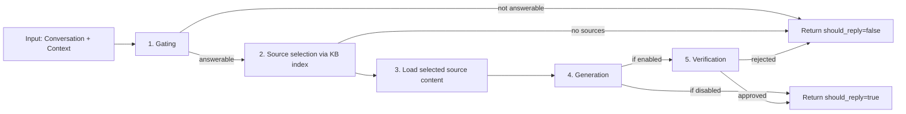

# Module Design: AI Response

## Purpose

The AI Response module is responsible for all LLM-based operations in the bot. Its primary purpose is to generate safe answers to user questions using a Knowledge Base. It also provides auxiliary services like text summarization to support Knowledge Base indexing.

## Responsibilities

- **Answer Generation**: Orchestrate a multi-step workflow to decide if a question is answerable, select sources, load content, generate an answer, and verify it.
- **Text Summarization**: Generate concise summaries of source documents for the Knowledge Base index.
- **Safety & Verification**: Ensure answers are grounded in provided sources and safe to post.
- **Resource Management**: Efficiently manage LLM API calls and graph execution state.

## Public Interfaces

The `AIClient` exposes two distinct interfaces, each with a different implementation strategy tailored to its complexity.

### 1. Generate Reply (`generate_reply`)

This is the main entry point for the bot's conversational capabilities.

- **Input**: `Conversation`, `RequestContext`
- **Output**: `AIResult` (contains `should_reply`, `reply_text`)
- **Implementation**: **Graph-based Orchestration**.
  - Uses a `LangGraph` workflow to handle the complex logic of gating, retrieval, generation, and verification.
  - **Stateless**: The workflow is request-scoped and does not persist conversation history.
  - Supports retries, conditional branching, and structured outputs at each step.

### 2. Summarize for Index (`summarize_for_kb_index`)

This is a utility method used by the Knowledge Base module when building its index.

- **Input**: `source_id`, `text`
- **Output**: `str` (summary)
- **Implementation**: **Direct LLM Call**.
  - Uses a raw, stateless HTTP call to the LLM provider.
  - Avoids the overhead of the graph for a simple, single-step transformation task.

## Implementation Architecture

### Graph-based Orchestration (For `generate_reply`)

The complex "Generate Reply" workflow is modeled as a Directed Acyclic Graph (DAG) using `langgraph`.

#### Retrieval Strategy

The system does not use a traditional RAG pipeline where the user query is embedded and used to perform semantic search over the knowledge base.

Instead, retrieval is a two-stage, index-driven workflow:

1. The Knowledge Base provides a plain-text index where each entry contains a `source_id` and a short description of the source.
2. The LLM reads this index and selects the most relevant `source_id` values for the user question.
3. The system loads the full content for those selected sources and passes them as context to the answer-generation step.

This design makes the retrieval decision explicit and reviewable, and it avoids brittle query-to-embedding behavior for short or ambiguous questions.

Source ID rules:
- For file sources, `source_id` is a path relative to `kb.sources_dir`.
- For web sources, `source_id` is the URL.

#### High-level Node Graph

Nodes represent distinct processing steps:

1.  **Question Gating**: Decides if the input is a question and if it is answerable.
2.  **Source Selection**: Uses the KB index to pick relevant files.
3.  **Content Loading**: Fetches full text for selected files.
4.  **Answer Generation**: Synthesizes an answer.
5.  **Answer Verification**: Optional final check for quality and safety.

#### Graph Reuse and Concurrency

The Graph structure is the high-level container for the workflow logic.

- **Write Once, Run Many**: The `StateGraph` is defined and compiled into a `CompiledStateGraph` (Runnable) **once** at application startup.
- **Thread-Safety**: The compiled graph is immutable and thread-safe. A single instance handles all concurrent requests.
- **Stateless Execution**: While the graph *manages* state during a single request, it does not persist it. Each request starts with a fresh state. Checkpointing is explicitly disabled.

#### Detailed Node Designs

##### Node 1: Question gating
- **Goal**: Decide whether the input is answerable.
- **Inputs**: Conversation history, `gating_prompt`.
- **Output**: `should_reply`.
- **Behavior**: Fast fail if the user input is chit-chat or off-topic.

##### Node 2: Source selection
- **Goal**: Select relevant file paths from the KB index.
- **Inputs**: User question, `kb_index_text`, `selection_prompt`.
- **Output**: List of `selected_source_ids`.
- **Behavior**: The LLM analyzes the index (which contains file summaries) to pick the best matches.

##### Node 3: Load selected source content
- **Goal**: Retrieve full text for the chosen IDs.
- **Inputs**: `selected_source_ids`.
- **Output**: List of `{source_id, text}`.
- **Behavior**: Calls the Knowledge Base module. If loading fails for all sources, the flow stops.

##### Node 4: Answer generation
- **Goal**: Produce a concise answer.
- **Inputs**: User question, loaded source text, `answer_prompt`.
- **Output**: `draft_answer`.
- **Constraints**: Must use only provided context. Must not hallucinate.

##### Node 5: Answer verification
- **Goal**: Final safety check.
- **Inputs**: Draft answer, source context, `verification_prompt`.
- **Output**: `verification` (boolean).
- **Behavior**: Acts as a "supervisor" to reject low-quality or unsafe answers. This step is skipped unless verification is enabled in configuration.

## Link inclusion

When the selected sources include URL identifiers, the final reply text includes a short "Links" section with those URLs. This makes it easier for users to jump directly to the primary references without requiring citation formatting in the answer text.

### Direct LLM Interaction (For `summarize_for_kb_index`)

The summarization task is implemented differently for efficiency.

- **Direct HTTP**: Uses `aiohttp` to call the LLM API directly.
- **No Graph Overhead**: Bypasses LangGraph state management.
- **Simple Prompting**: Uses a single prompt to compress text into a summary.

## LLM Integration

The module interacts with the LLM in two ways, depending on the complexity of the task:

1.  **Via LangChain (used in `generate_reply`)**:
    - **Context**: Used within the **LangGraph workflow** for complex, multi-step orchestration (Gating, Selection, Generation, Verification).
    - **Mechanism**: Uses `langchain-openai` (`ChatOpenAI`) as the standard client. A single `ChatOpenAI` instance is created at startup and injected into the graph nodes.

2.  **Via Direct HTTP (used in `summarize_for_kb_index`)**:
    - **Context**: Used by the **Knowledge Base indexer** for simple, single-shot text processing.
    - **Mechanism**: Uses `aiohttp` for raw, lightweight HTTP POST requests, bypassing LangChain to reduce overhead.

## Shared Data Models

See `src/community_intern/core/models.py`. The module relies on:
- `Conversation`: Platform-agnostic chat history.
- `AIResult`: The standardized output contract.

## Configuration

The AI module is configured under the `ai` section in `config.yaml`.

### Shared Keys (Connection & Resilience)
- `llm_base_url`: Base URL for the LLM API.
- `llm_api_key`: API key for the LLM.
- `llm_model`: Model name to use.
- `llm_timeout_seconds`: Timeout per individual LLM call (network timeout).
- `max_retries`: Maximum retry attempts for transient failures.

### Graph-Specific Keys (`generate_reply`)
- **Workflow Timeout**: `graph_timeout_seconds` (End-to-end timeout for the entire graph execution).
- **Project Introduction**: `project_introduction` (shared domain introduction appended to multiple prompt steps).
- **Verification Toggle**: `enable_verification` (When `true`, run the verification step after generation. When `false`, return the generated answer as final without verification. Default: `false`.)
- **Prompts**: `gating_prompt`, `selection_prompt`, `answer_prompt`, `verification_prompt`.
- **Limits**: `max_sources`, `max_answer_chars`.

### Direct Call Keys (`summarize_for_kb_index`)
- **Prompts**: `summarization_prompt`.
- **Behavior**: Uses shared `llm_timeout_seconds` and `max_retries` for the HTTP request.

## Error Handling

- **Timeouts**: Strict timeouts apply to the overall request and individual LLM calls.
- **Fail-Safe**: If any step in the graph fails (e.g., API error, validation error), the module returns `should_reply=false` rather than crashing.
- **Logging**: Detailed logs capture the decision path (gating -> selection -> generation) for debugging.

## Prompt Assembly Rules

The configuration provides task-focused prompt content only. The runtime assembles the final system prompts by appending shared and fixed requirements in code:

- `project_introduction` is appended to the system prompt for gating, source selection, answer generation, verification, and summarization.
- Output format requirements for gating, selection, and verification are enforced in code and are not configurable.

## Observability

- **Logs**: Latency, decision outcomes (e.g., `should_reply`), and token usage.
- **Metrics**:
  - `ai_requests_total`: Counters for success/skip/error.
  - `ai_gate_total`: Track how often the bot decides to answer.
