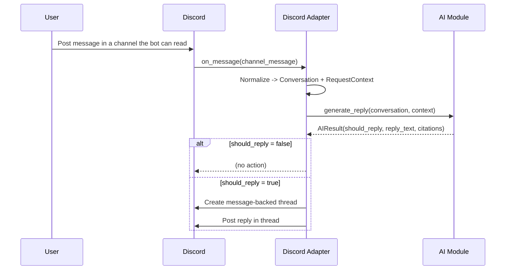
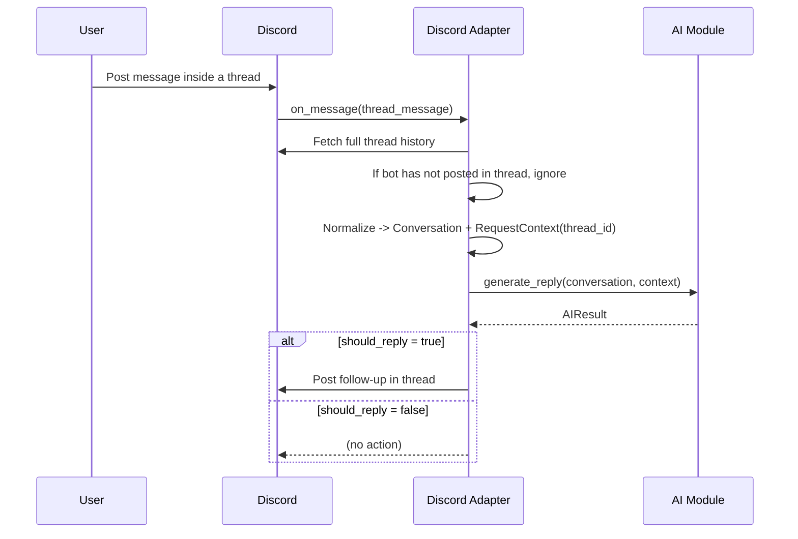

# Module Design: Bot Integration (Discord Adapter)

## Purpose

The Discord adapter connects to Discord, listens to all channels it can read (based on Discord permissions) and eligible threads, normalizes Discord events into a platform-neutral `Conversation`, calls the AI module, and posts the AI result inside message-backed threads.

This module owns **all Discord-specific concerns**: intents, permissions, rate limits, and thread creation.

## Responsibilities

- Subscribe to Discord gateway events for all readable channels.
- Normalize Discord messages and threads into a platform-neutral format.
- Route events:
  - New channel message -> call AI with a single-message conversation.
  - Thread update (thread previously answered by bot) -> call AI with full thread context.
- Create message-backed threads and post replies.
- Enforce safety policies:
  - Avoid blocking the event loop (all I/O is async).
- Emit structured logs/metrics around decisions and Discord API calls.

## External dependencies

- `discord.py` (target: 2.6.4)
- An AI module client implementing `AIClient.generate_reply(...)` (defined below)

## Runtime configuration

All configuration is loaded from `config.yaml` with environment-variable overrides as specified in `docs/configuration.md`.

The adapter reads these keys:

- `discord.token`
- `discord.ai_timeout_seconds`
- `app.dry_run`

The adapter derives `BOT_USER_ID` at runtime after login.

## Data models (platform-neutral boundary)

These models are shared at module boundaries. The Discord adapter is responsible for producing them accurately.

See the shared boundary models in:

- `src/discord_intern/core/models.py`

## Adapter -> AI interface

The adapter depends on an AI client that exposes a single method and returns a strict schema:

See:

- `src/discord_intern/ai/interfaces.py` (`AIClient`)

## Discord event handling design

### Intents and permissions

- Enable **only required intents**.
- The bot must have `Intents.message_content` enabled (Developer Portal + code) because it reads arbitrary message text.
- Ensure permissions for:
  - Reading messages in channels you want the bot to monitor
  - Creating threads from messages
  - Sending messages in threads

### Cogs and separation of concerns

The adapter is implemented as a single Discord.py Cog:

- `MessageRouterCog`
  - Handles all message events via `on_message`.
  - If the message is in a guild channel (and not a thread):
    - Calls AI with a single-message conversation.
    - If `should_reply=true`, creates a message-backed thread and posts the answer.
  - If the message is in a thread:
    - Fetch the full thread history.
    - If the bot has not posted in the thread (detected by scanning the thread history for `author_id == BOT_USER_ID`), ignore the message.
    - Otherwise, call AI with the full thread context and post a follow-up when `should_reply=true`.

### Thread eligibility rule (no adapter state)

The adapter routes a thread message to the AI module only when the bot has already posted in that thread.

Definition:
- A thread is eligible if at least one message in the fetched thread history has `author_id == BOT_USER_ID`.

## Normalization rules (Discord -> Conversation)

### Message selection

- Channel message flow: the `Conversation` contains exactly one user message (the triggering message).
- Thread update flow: the `Conversation` contains the full thread history, ordered oldest -> newest.

### Role mapping

- User-authored messages -> `role="user"`
- Bot-authored messages -> `role="assistant"`
- System events are not included in v1.

### Text normalization

- Preserve message content as-is, but:
  - Strip leading/trailing whitespace
  - Remove empty messages

## Posting policy

- Post answers only in threads:
  - For new channel messages, create a message-backed thread from the triggering message.
  - For thread updates, reply in the same thread.
- If AI returns `should_reply=false`, do nothing (no thread creation, no message posting).

## Sequence diagrams

### New channel message -> create thread -> post answer

### Thread update -> call AI with full thread -> post follow-up

## Error handling

### AI call failures

- Time out the AI request using `discord.ai_timeout_seconds`.
- On timeout or provider error:
  - Log the failure (with IDs and timing).
  - Do not post an answer.
  - Do not create a thread.

### Discord API failures

- Thread creation fails:
  - Log the error and stop; do not attempt to post.
- Posting fails:
  - Log the error and stop; do not retry.

## Observability

### Logs (structured)

Log fields per handled event:

- `platform`, `guild_id`, `channel_id`, `thread_id`, `message_id`, `author_id`
- `routing`: `channel_message` vs `thread_update`
- `ai.should_reply`
- `latency_ms`: AI call, Discord API calls
- `error.type`, `error.message` (if any)

### Metrics (optional)

- `adapter_events_total{type=...}`
- `ai_calls_total{result=success|timeout|error}`
- `ai_should_reply_total{value=true|false}`
- `discord_api_calls_total{endpoint=...}`

## Test plan

- Unit tests:
  - Normalization (Discord message -> `Message`)
  - Routing decision (channel vs thread, bot-authored message filtering)
  - “Answered thread” registry behavior
- Integration tests (manual or mocked):
  - Create message-backed thread from a channel message
  - Thread follow-up flow with full history
