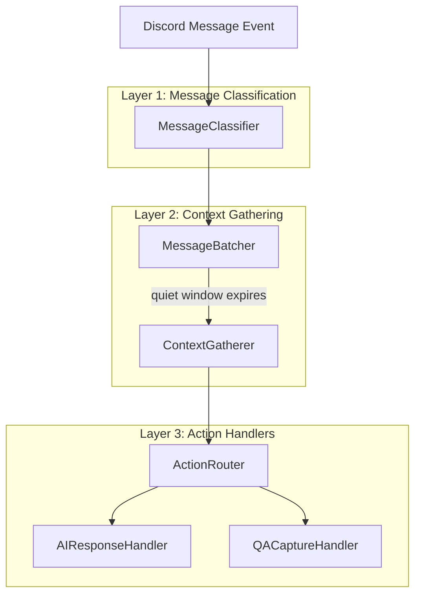
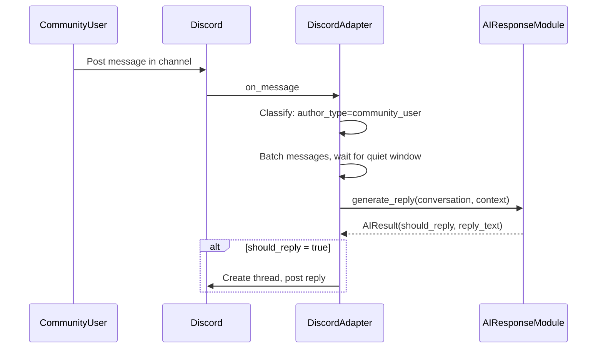
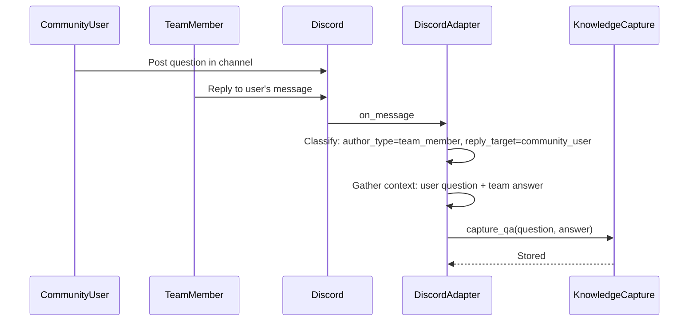
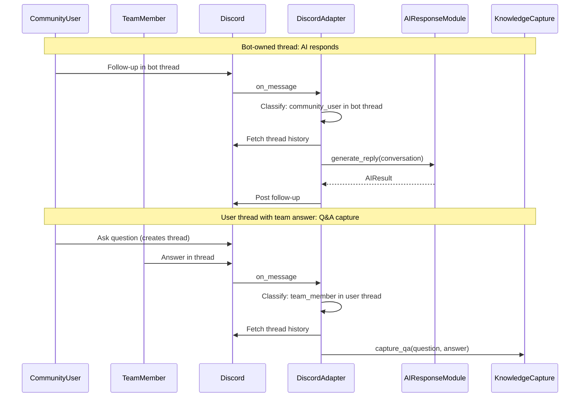

# Module Design: Bot Integration (Discord Adapter)

## Purpose

The Discord adapter connects to Discord, listens to all channels it can read (based on Discord permissions) and eligible threads, and routes messages to appropriate handlers based on message classification.

This module owns **all Discord-specific concerns**: intents, permissions, rate limits, thread creation, and unified message routing.

The adapter supports multiple action handlers:
- **AI Response Handler**: Responds to community user questions via the AI response module
- **Q&A Capture Handler**: Captures team member replies for the knowledge base (see [`module-team-knowledge-capture.md`](./module-team-knowledge-capture.md))

## Responsibilities

- Subscribe to Discord gateway events for all readable channels.
- Classify incoming messages by author type, location, and reply context.
- Gather message context (thread history, reply chains, batched messages).
- Route to appropriate action handlers based on classification.
- Create message-backed threads and post replies.
- Enforce safety policies:
  - Avoid blocking the event loop (all I/O is async).
- Emit structured logs/metrics around decisions and Discord API calls.

## External dependencies

- `discord.py` (target: 2.6.4)
- An AI response service implementing `generate_reply(...)` (defined below)

## Runtime configuration

All configuration is loaded from `config.yaml` with environment-variable overrides as specified in [`./configuration.md`](./configuration.md).

The adapter reads these keys:

- `discord.token`
- `discord.message_batch_wait_seconds`
- `discord.team_member_ids`
- `app.dry_run`

The adapter derives `BOT_USER_ID` at runtime after login.

## Data models (platform-neutral boundary)

These models are shared at module boundaries. The Discord adapter is responsible for producing them accurately.

See the shared boundary models in:

- `src/community_intern/core/models.py`

## Adapter -> AI interface

The adapter depends on an AI response service that exposes a single method and returns a strict schema:

See:

- `src/community_intern/ai_response/impl.py` (`AIResponseService`)

---

## Message Routing Architecture

The adapter processes messages through three layers:



The message batcher accumulates consecutive messages from the same author. Processing only proceeds to context gathering and action routing after the quiet window expires.

---

## Layer 1: Message Classification

### MessageContext

When a message arrives, the classifier produces a `MessageContext`:

| Field | Type | Description |
|-------|------|-------------|
| `author_type` | `community_user` \| `team_member` \| `bot` | Who sent this message |
| `location` | `channel` \| `thread` | Where the message was posted |
| `reply_target` | `MessageTarget` or `None` | If a reply, info about the referenced message |
| `thread_owner_type` | `community_user` \| `team_member` \| `bot` \| `None` | For threads, who started it |

The `MessageTarget` contains:
- `author_type`: the type of the referenced message's author
- `author_id`: the Discord user ID of the referenced message's author

### Classification rules

Author type determination:
- If `author_id == BOT_USER_ID` → `bot`
- If `author_id` in `discord.team_member_ids` → `team_member`
- Otherwise → `community_user`

Reply target resolution:
- If the message has a `reference` field, fetch the referenced message
- Classify the referenced message's author using the same rules
- If the reference cannot be resolved, `reply_target` is `None` (treat as unresolvable)

Thread owner determination:
- For thread messages, check `thread.owner_id`
- Classify using the same author type rules

---

## Layer 2: Context Gathering

Shared infrastructure used by all action handlers.

### Thread history fetching

When processing a thread message:
- Fetch full thread history via Discord API
- Order messages oldest → newest
- Each handler decides how to use the history

### Reply chain resolution

When a message is a reply, the system walks the reply chain and expands consecutive messages:

**Basic algorithm**:
1. Fetch the directly referenced message
2. Expand bidirectionally: fetch consecutive messages from the same author both before and after the referenced message (within quiet window)
3. Walk up: if the referenced message is also a reply, recursively apply steps 1-2 to its reference
4. Stop when reaching a message with no reply reference or when reaching a configured depth limit

**Example: Multi-message question with later follow-up**

```
User: "I'm having an issue..."        <- Message A (no reply)
User: "Here's the error log..."       <- Message B (consecutive to A)
User: "I'm using version 2.0"         <- Message C (consecutive to B)
Team: "Try restarting the service"    <- Message D, reply to C
... time passes ...
User: "That didn't work"              <- Message E, reply to D
```

When processing Message E (the follow-up):
- Message E replies to Message D (team's answer)
- Walk up: Message D references Message C
- Expand bidirectionally from C: Messages A, B, C (consecutive from same author)
- Result: full original question context (A, B, C) captured along with the conversation (D, E)

**Example: Reply to middle of consecutive messages**

```
User: "I have two questions"          <- Message A
User: "First, about X..."             <- Message B (consecutive)
User: "Second, about Y..."            <- Message C (consecutive)
Team: "For X, you should..."          <- Reply to B (middle message)
```

When processing the team's reply:
- Direct reference: Message B
- Expand backwards: Message A
- Expand forwards: Message C
- Result: Messages A, B, C all captured as the question

**Example: Fragmented reply chain**

```
User: "Question about X"              <- Message A
User: "More context"                  <- Message B (consecutive)
Team: "Answer about X"                <- Reply to B
User: "Follow-up about Y"             <- Message C (no reply, new topic)
User: "Y details"                     <- Message D (consecutive to C)
Team: "Answer about Y"                <- Reply to D
User: "But what about X again?"       <- Reply to Team's first answer
```

When processing "But what about X again?":
- Direct reference: Team's answer about X
- Walk up: Team's answer references Message B
- Expand backwards from B: Messages A, B
- Result: original X question context captured

**Provided to handlers**:
- `reply_chain`: ordered list of message groups, oldest first
- Each group contains consecutive messages from the same author

### Message batching

Groups consecutive messages from the same author within a quiet window. This applies to both community users and team members.

Rules:
- Start a wait timer after receiving a message in a channel
- If another message from the same author arrives before the timer expires, reset the timer and add to the batch
- Messages from other authors do not affect the timer
- When the timer expires, the batch is ready for processing
- Only after the quiet window expires does the system proceed to context gathering and action routing

This ensures:
- Community user's multi-message question is captured as a complete batch before AI processing
- Team member's multi-message answer is captured as a complete batch before Q&A storage
- Image-only messages are preserved and batched with adjacent text

Configuration:
- `discord.message_batch_wait_seconds`: quiet window duration (default: 60 seconds)

---

## Layer 3: Action Handlers

### Action routing rules

The `ActionRouter` uses the `MessageContext` to determine which handler(s) to invoke:

| MessageContext | Handler | Notes |
|----------------|---------|-------|
| `author_type=bot` | None | Ignore all bot messages |
| `author_type=community_user`, `location=channel`, no reply or reply to self | `AIResponseHandler` | Standard question flow |
| `author_type=community_user`, `location=channel`, reply to another user | None | Ignore cross-user replies |
| `author_type=community_user`, `location=thread`, `thread_owner_type=bot` | `AIResponseHandler` | Follow-up in bot thread |
| `author_type=community_user`, `location=thread`, `thread_owner_type!=bot` | None | Ignore non-bot threads |
| `author_type=team_member`, `reply_target.author_type=community_user` | `QACaptureHandler` | Team answering user |
| `author_type=team_member`, `location=thread`, thread has community user question | `QACaptureHandler` | Team answering in thread |
| `author_type=team_member`, `reply_target.author_type=team_member` | None | Ignore team-to-team |
| `author_type=team_member`, no reply context | None | Ignore standalone team messages |

### Handler interface

Each handler implements:

```python
async def handle(
    message: discord.Message,
    context: MessageContext,
    gathered_context: GatheredContext
) -> None
```

Where `GatheredContext` contains:
- `batch`: list of batched messages from the current author (after quiet window)
- `thread_history`: list of thread messages (if applicable)
- `reply_chain`: list of message groups from walking the reply chain, each group containing consecutive messages from the same author, ordered oldest first
- `reply_target_message`: the directly referenced message (for convenience, also included in reply_chain)

---

## AI Response Handler

Handles community user questions by calling the AI response module and posting responses.

### Trigger conditions

- Community user posts in a channel (batched, after quiet window)
- Community user follows up in a bot-owned thread

### Channel message flow

1. Receive batched messages from context gathering
2. Normalize to `Conversation` (see normalization rules below)
3. Call `AIResponseService.generate_reply(conversation, context)`
4. If `should_reply=true`:
   - Create a message-backed thread from the last message in the batch
   - Post the reply in the thread
5. If `should_reply=false`: do nothing

### Thread message flow

1. Receive thread history from context gathering
2. Verify bot has posted in this thread (at least one message with `author_id == BOT_USER_ID`)
3. If not, ignore the message
4. Normalize to `Conversation`
5. Call `AIResponseService.generate_reply(conversation, context)`
6. If `should_reply=true`: post follow-up in the thread
7. If `should_reply=false`: do nothing

### Normalization rules

Role mapping:
- Community user messages → `role="user"`
- Bot messages → `role="assistant"`
- Team member messages → `role="assistant"` (when present in thread history)

Text normalization:
- Strip leading/trailing whitespace
- Remove empty messages

Image normalization:
- Include image attachments as `Message.images`
- Keep messages that contain images even when text is empty
- Convert Discord image URLs to base64 before passing to the AI response service

### Posting policy

- Post answers only in threads
- For new channel messages, create a message-backed thread from the last message
- For thread updates, reply in the same thread

---

## Q&A Capture Handler

Captures team member replies to community users for the knowledge base.

See [`module-team-knowledge-capture.md`](./module-team-knowledge-capture.md) for full specification.

### Trigger conditions

- Team member replies to a community user's message (via Discord reply)
- Team member posts in a thread where a community user asked a question

### Handler behavior

1. Gather the Q&A context:
   - Question: the community user's message(s)
   - Answer: the team member's reply message(s)
2. Apply message batching for consecutive messages from the same author
3. Dispatch to the Team Knowledge Capture module for storage and indexing

---

## Discord event handling design

### Intents and permissions

- Enable **only required intents**.
- The bot must have `Intents.message_content` enabled (Developer Portal + code) because it reads arbitrary message text.
- Ensure permissions for:
  - Reading messages in channels you want the bot to monitor
  - Creating threads from messages
  - Sending messages in threads

### Cogs and separation of concerns

The adapter is implemented as a single Discord.py Cog:

- `MessageRouterCog`
  - Handles all message events via `on_message`
  - Runs message classification
  - Gathers context
  - Routes to appropriate handler(s)

---

## Sequence diagrams

### Community user question -> AI response



### Team member reply -> Q&A capture



### Thread follow-up flows



---

## Error handling

### AI call failures

- On timeout or provider error:
  - Log the failure (with IDs and timing)
  - Do not post an answer
  - Do not create a thread
  - If any required image download fails, do not answer

### Discord API failures

- Thread creation fails:
  - Log the error and stop; do not attempt to post
- Posting fails:
  - Log the error and stop; do not retry

### Q&A capture failures

- See error handling in [`module-team-knowledge-capture.md`](./module-team-knowledge-capture.md)

---

## Observability

### Logs (structured)

Log fields per handled event:

- `platform`, `guild_id`, `channel_id`, `thread_id`, `message_id`, `author_id`
- `author_type`: `community_user` | `team_member` | `bot`
- `routing`: `ai_response` | `qa_capture` | `ignored`
- `ai_response.should_reply` (when applicable)
- `latency_ms`: AI call, Discord API calls
- `error.type`, `error.message` (if any)

### Metrics (optional)

- `adapter_events_total{type=...}`
- `adapter_routing_total{handler=ai_response|qa_capture|ignored}`
- `ai_response_calls_total{result=success|timeout|error}`
- `ai_response_should_reply_total{value=true|false}`
- `qa_capture_total{result=success|error}`
- `discord_api_calls_total{endpoint=...}`

---

## Test plan

- Unit tests:
  - Message classification (author type, location, reply target)
  - Action routing (correct handler selection based on MessageContext)
  - Normalization (Discord message -> `Message`)
  - Message batching per channel and per author
- Integration tests (manual or mocked):
  - Community user question -> AI response flow
  - Team member reply -> Q&A capture flow
  - Thread follow-up flows for both handlers
